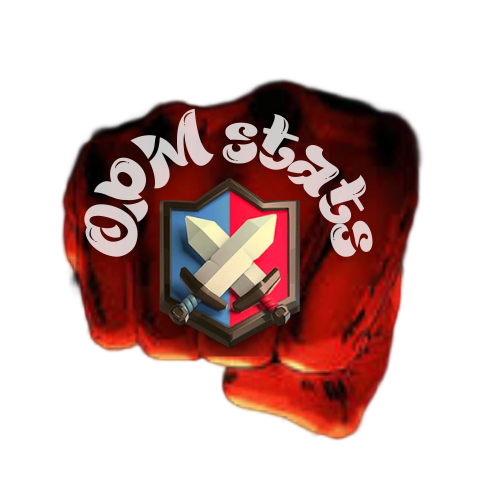

# OPM Bot

  

 

### A Discord bot to manage the Clash Royale clans and clan wars of the One Punch Man Family.

 

## Features

- Commands list :
  - `/ffhelp` : Shows the help menu
  - `/ffattacks` : Shows the remaining attacks of the day and can ping remaining players
  - `/ffavg` : Shows the average war points of the players sending an Excel spreadsheet and the associated png
  - `/ffgethours` : Shows the hours of the daily reports and resets
  - `/ffgetrotates` : Shows the rotations of the players between the clans
  - `/ffmembers` : Shows the members of the clan
  - `/ffopponents` : Shows information about the war opponents and their Colosseum history the last 3 seasons
  - `/ffplayer` : Shows the player's profile
  - `/ffrace` : Shows the current war day status (or Colosseum)
  - `/ffresults` : Shows the points of all the war participants
  - `/ffriver` : Shows the current river race (or Colosseum)
  - `/ffreport` : Shows the war report
  - `/ffrmhours` : Removes the hours for the daily reports and resets
  - `/ffrmrotate` : Removes an entry from the rotations
  - `/ffsethours` : Sets the hours for the daily reports and resets on the calling channel
  - `/ffsetrotates` : Sets the rotations of the players between the clans

- Scheduled war report has been added to the bot ! It will be sent every day from friday to monday at the reset hour in the clan war channel.
- Scheduled `/ffrace` and `/ffattacks` with ping has been added to the bot ! It will be sent every day from friday to monday at 01h00 and from Thurday to Sunday at 23h00 in the clan war channels.

- Responds a link to the RoyaleAPI player profile when a player tag is sent in a room where the bot is present.
  Sends a screenshot of the player war history and the graph associated.

- Send an Excel spreadsheet with the war results and averages with colors.

- 31/08/2023 : New display is beginning its deployment !
Old version is still available with the option `text_version: True`.
